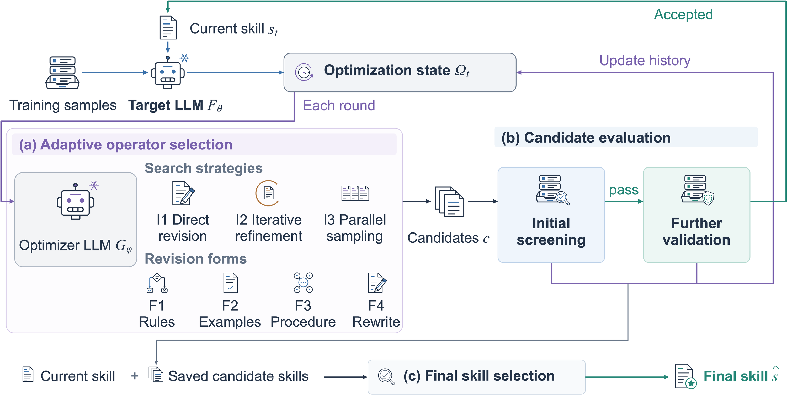

<div align="center">

# StraTune: Adaptive Selection of Revision Operators for Self-Evolving LLM Skills

Zeping Liu<sup>1</sup>, Yan Li<sup>2</sup>, Ni Lao<sup>1</sup>, Gil Wolff<sup>2</sup>, Gengchen Mai<sup>1,&#8224;</sup>

<sup>1</sup>The University of Texas at Austin &nbsp;&nbsp; <sup>2</sup>Amazon &nbsp;&nbsp; <sup>&#8224;</sup>Corresponding author

[](https://arxiv.org/abs/2609.32886)
[](https://huggingface.co/datasets/PingL/StraTune_dataset)
[](LICENSE)
[](requirements.txt)

</div>

<p align="center">
  
</p>
<p align="center"><em><b>Overview of StraTune.</b> (a) The optimizer LLM selects a revision operator from the optimization state and generates candidate skills. (b) Candidates pass initial screening and further validation, and every outcome is recorded in the evaluation history. (c) Final skill selection compares the current skill with saved candidate skills.</em></p>

## Overview

LLMs can learn reusable textual skills from execution feedback without updating their parameters.
Existing methods fix one *revision operator*, a search strategy and the revision forms applied under it,
for the whole run, yet no single operator performs best across tasks. **StraTune** lets a frozen
optimizer LLM choose the operator at every round from the optimization state:

- **Search strategies:** I1 direct revision, I2 iterative refinement, I3 parallel sampling.
- **Revision forms:** F1 conditional rules, F2 worked examples, F3 reasoning procedure, F4 full rewrite.
- **Candidate evaluation:** every candidate skill passes initial screening on a small sample set and
  further validation on a larger one before it replaces the current skill, and every outcome is written
  back to the optimization state for later choices.

## Main results

Test scores (0-100) under a training budget of 6 |D_train| target-LLM executions.

| Method | DocVQA | LiveMath | Mind2Web | SpreadsheetBench |
|---|---:|---:|---:|---:|
| ***Target Haiku 4.5, optimizer Sonnet 4.6*** | | | | |
| Initial skill | 47.88 | 29.38 | 46.09 | 40.00 |
| GEPA | 91.26 | 43.60 | 46.18 | 52.50 |
| TextGrad | 90.69 | 31.75 | 46.16 | 45.00 |
| SkillOpt | 91.87 | 45.02 | 40.55 | 50.71 |
| Trace2Skill | 90.62 | 33.18 | 46.18 | 46.79 |
| Iter-CoT | 73.42 | 36.97 | **47.99** | 48.57 |
| **StraTune** | **92.12** | **65.88** | 47.49 | **56.43** |
| ***Target Opus 4.8, optimizer Opus 5*** | | | | |
| Initial skill | 94.04 | 42.18 | 41.80 | 39.29 |
| GEPA | 95.26 | 78.20 | 50.50 | **72.86** |
| TextGrad | 94.37 | 52.61 | 50.32 | 71.43 |
| SkillOpt | 95.25 | 74.41 | 50.26 | 70.71 |
| Trace2Skill | 95.56 | 53.08 | 50.20 | 71.79 |
| Iter-CoT | 95.25 | 48.34 | 49.92 | 65.71 |
| **StraTune** | **96.95** | **81.52** | **51.63** | **72.86** |

The learned skills of the StraTune rows are in [`data/skills/`](data/skills).

## Installation

```bash
git clone https://github.com/seai-lab/StraTune.git && cd StraTune
pip install -r requirements.txt
```

Models are called through Amazon Bedrock. Configure AWS credentials with Bedrock access (`AWS_PROFILE`,
access keys, or `AWS_BEARER_TOKEN_BEDROCK`) and set `AWS_REGION` (the paper used `us-west-2`).

| Setting | Target LLM | Optimizer LLM |
|---|---|---|
| Haiku/Sonnet (main) | `global.anthropic.claude-haiku-4-5-20251001-v1:0` | `global.anthropic.claude-sonnet-4-6` |
| Opus | `us.anthropic.claude-opus-4-8` | `us.anthropic.claude-opus-5` |

## Data

**Sample data.** [`data/benchmark_sample/`](data/benchmark_sample) holds 40 training and 20 test tasks of
each benchmark, enough to run every stage of the code. The numbers it produces are not the paper's.

**Full data.** The exact splits of the paper (about 1 GB) are on the
[Hugging Face Hub](https://huggingface.co/datasets/PingL/StraTune_dataset):

```bash
hf download PingL/StraTune_dataset --repo-type dataset --local-dir benchmark_data
for s in train test; do tar -xzf benchmark_data/SpreadsheetBench/$s/spreadsheet.tar.gz -C benchmark_data/SpreadsheetBench/$s; done
```

| Dataset | Train | Test | Metric |
|---|---:|---:|---|
| DocVQA | 500 | 1,000 | ANLS |
| LiveMathematicianBench | 397 | 211 | answer accuracy |
| Mind2Web | 800 | 252 | element accuracy |
| SpreadsheetBench | 629 | 280 | fraction of tasks passing all checks |

`STRATUNE_BENCHMARK_DATA` selects which data the code reads. DocVQA page images are extracted once per
split before training:

```bash
export STRATUNE_BENCHMARK_DATA=$PWD/benchmark_data        # or $PWD/data/benchmark_sample
python3 -m method.environments.datasets.materialize_docvqa train
python3 -m method.environments.datasets.materialize_docvqa test
```

## Quick start

```bash
export AWS_REGION=us-west-2
export STRATUNE_BENCHMARK_DATA=$PWD/data/benchmark_sample
python3 -B method/tests/smoke_test.py                                          # offline checks
method/scripts/train.sh livemath haiku --dry-run                               # 4 short rounds
method/scripts/evaluate.sh --skill data/skills/haiku/livemath.txt --dataset livemath
```

## Reproducing the paper

```bash
export STRATUNE_BENCHMARK_DATA=$PWD/benchmark_data
method/scripts/train.sh <docvqa|livemath|mind2web|spreadsheetbench> [haiku|opus]
method/scripts/evaluate.sh --run-id <run_id> --workers 8
```

`train.sh` selects the hyperparameters in [`method/configs/`](method/configs) and the model ids of the
setting. Each run has a training budget of 6 |D_train| target-LLM executions (3000 / 2382 / 4800 / 3774
for DocVQA / LiveMath / Mind2Web / SpreadsheetBench) and is written to `runtime_data/runs/<run_id>/`, with
the final skill in `final_skill.txt`. `evaluate.sh` scores a completed run or any skill file on the test
split; set `STRATUNE_TARGET_MODEL` to the target LLM of the setting. Both LLMs run at temperature 0, and
results still vary across runs because of API nondeterminism and the samples drawn in each round. The
baselines were run with their public implementations and are not part of this repository.

## Repository structure

```text
method/
  train.py, evaluate.py, config.py   training loop, test evaluation, datasets and budgets
  operators/                         revision operators: strategy and form selection, I1-I3, F4
  evaluation/                        candidate evaluation: screening sets, paired execution, acceptance rules
  state/                             optimization state: current skill, execution feedback, histories
  environments/                      task environments, dataset loaders, metrics, Bedrock client
  configs/, scripts/, tests/         hyperparameters of the paper's runs, train.sh / evaluate.sh, smoke test
data/
  benchmark_sample/                  40 train + 20 test tasks per benchmark
  strata/                            per-task stratification fields
  initial_skills/, skills/           initial skill of each dataset; final skills of the paper's runs
assets/                              figures
```

## Citation

If you find this work useful, please cite:

```bibtex
@article{liu2026stratune,
  title   = {StraTune: Adaptive Selection of Revision Operators for Self-Evolving LLM Skills},
  author  = {Liu, Zeping and Li, Yan and Lao, Ni and Wolff, Gil and Mai, Gengchen},
  journal = {arXiv preprint arXiv:2609.32886},
  year    = {2026}
}
```

## License

The code is released under the [MIT License](LICENSE). The benchmark data keep the licenses of their
sources, listed on the [dataset page](https://huggingface.co/datasets/PingL/StraTune_dataset).
